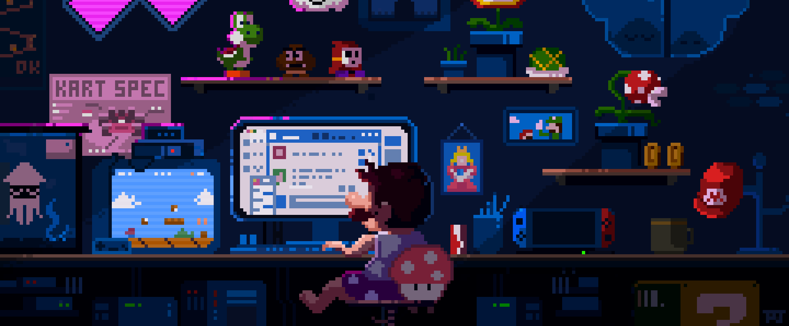

<link rel="preconnect" href="https://fonts.googleapis.com">
<link rel="preconnect" href="https://fonts.gstatic.com" crossorigin>
<link href="https://fonts.googleapis.com/css2?family=Press+Start+2P&display=swap" rel="stylesheet">

 
  

## 📫 How to reach me 📫

## 📚 About Me 📚

I have 8+ years of dev experience. Have Master's degree in Nuclear Physics and NPPs Engineering. My main traits are: problem solving (coding), curiosity, perseverance and empathy. I am passionate about machine learning, computer vision, and science.

As an engineering manager, and software engineer I focus on: the product quality and code, well-organized teamwork, healthy and friendly atmosphere in the team, and the result (result delivered on time).I have high standard expectations from UX/UI. I’m an easily challenged person, the more difficult the task in front of me is, the more enthusiastically I tackle it. I like learning new technologies. Have deep expertise in front end development, back end, databases, UX/UI.

## 📆 Current state 📆

- 🔭 I’m currently working on E-commerce project as Engineering Manager
- 🌱 I’m currently learning Machine learning and Computer Vision

## 📊 My GitHub Stats 📊

## 📈 My Activity Graph 📈

## 💻 My Tech Stack 💻

---

  
  
  
  
  
  
  
  
  
  

