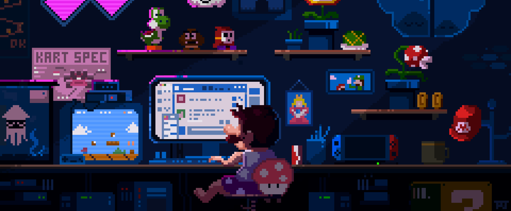

<link rel="preconnect" href="https://fonts.googleapis.com">
<link rel="preconnect" href="https://fonts.gstatic.com" crossorigin>
<link href="https://fonts.googleapis.com/css2?family=Press+Start+2P&display=swap" rel="stylesheet">

  
  

## 📫 How to reach me 📫

## 📚 About Me 📚

<strong>Engineering Manager · Team lead · Full-Stack Engineer · ML Engineer</strong>

I have 8+ years of development experience and a Master's degree in Nuclear Physics and NPPs Engineering. My core traits are problem solving, curiosity, perseverance, and empathy. I am passionate about machine learning, computer vision, and science.

As an Engineering Manager and software engineer, I focus on product quality, clean code, well-organized teamwork, and a healthy team culture — with results delivered on time. I have high UX/UI standards, thrive under pressure, and the more difficult the task, the more enthusiastically I tackle it. I have deep expertise in front-end development, back-end, databases, and UX/UI. I have a high level of AI tools adoption — including advanced usage of Claude Code and AI-assisted workflows. I actively build automated processes and pipelines for web development, leveraging AI tools to maximize engineering efficiency and team productivity.

## 📆 Current State 📆

- 🔭 Currently working on an e-commerce project as Engineering Manager
- 🌱 Currently learning Machine Learning and Computer Vision

## 📊 My GitHub Stats 📊

  
  

## 📈 My Activity Graph 📈

## 💻 My Tech Stack 💻

---

  
  
  
    
  
  
    
  
  
    
  
  

